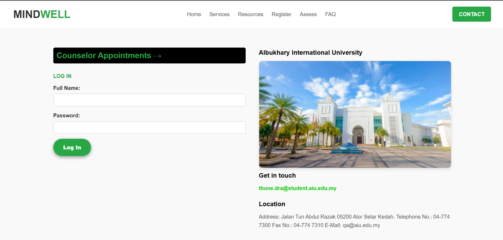

# Mindwell Web
Mindwell Web is a mental well-being platform designed to empower users by providing mental health resources, encouragement, and personalized support. The web application allows users to explore content freely, register for an account, and book appointments with counselors. Admins can manage appointments and communicate directly with users through a streamlined interface.

## Overview

Mindwell Web focuses on promoting mental wellness by:

Providing mental health resources and encouragements that are accessible to everyone without login.

Allowing registered users to book appointments with counselors.

Offering an admin interface to manage and approve appointments efficiently.

## Features

### First view of Mindwell

### Mental Health Resources

### User registration and login system

### Appointment booking system with dynamic user interface

### Admin Panel Management
#### User Appointment Requests

#### Mental Counselor Meeting Schedules

### Real-time updates for users to see admin responses

### Three main data tables

#### Appointment Requests Table – Tracks requests submitted by users

#### Approval Table – Displays appointments approved by admin with details

#### User Info Table – Stores user full name, email, and login credentials

## User Workflow

Visit the website and browse mental health resources without logging in.

Register an account to book appointments with a counselor.

After logging in, submit an appointment request including phone number and mental issue.

View admin responses dynamically on the same page after login.

Admin Workflow

Login to the admin interface.

View all appointment requests from users.

Respond with venue, date, and time for each appointment.

Approved appointments are displayed in the approval table.

Ensure user requests and responses are properly synchronized in the database.
